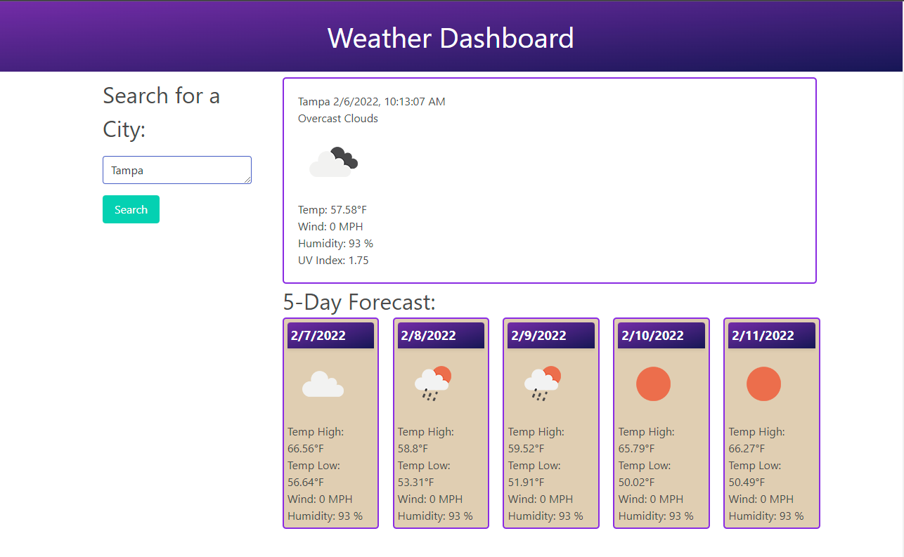

# Weather Dashboard

## Purpose 
This app will show you very useful live weather information for a given city. I have included following features into the application.

* Integrated OpenWeatherMap API to capture live weather information
* For the current day, you will be able to find the Temperature, Wind speed, Humidity and the UV Index.
* The 5 day forecast will show the Temperature high and low, Wind speed and Humidity for the upcoming days.
* There are definitely room for improvement but the basic functionality is working perfectly.

## Built with 🛠️

* JavaScript
* HTML
* CSS

## Website
https://thisaramallawaarachchige.github.io/weather-dashboard/

## Contribution

Made with ❤️ by Thisara MA